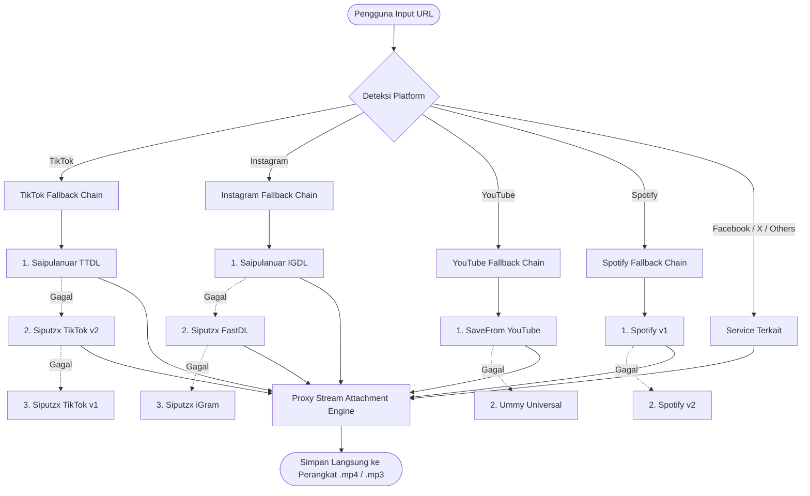

# ⚡ SnapMedia — All-in-One Social Media & Music Downloader

<div align="center">

[](https://github.com/andrizre/media-downloader)
[](https://github.com/andrizre)


**A minimalist, ultra-fast, and ad-free multi-platform media downloader inspired by [cobalt.tools](https://cobalt.tools).**
Built with **Enterprise-Grade Modular Architecture**, **Multi-Provider Fallback Engine**, **High-Efficiency Web Performance Optimization (WPO)**, and **Full Search Engine Optimization (SEO)**.

[Platform Didukung](#-platform-yang-didukung-14-layanan) • [Metode Fallback](#-arsitektur-metode-fallback) • [Optimasi SEO & WPO](#-optimasi-seo--wpo) • [Struktur Proyek](#-struktur-direktori-modular) • [Dokumentasi API](#-dokumentasi-api) • [Kontributor](#-kontributor--kredit)

</div>

---

## 🌐 Platform yang Didukung (14+ Layanan)

| Platform | Format Media | Rantai Provider & Fallback |
| :--- | :--- | :--- |
| **TikTok** | Video HD (No Watermark), Audio MP3 | Saipulanuar TTDL ➔ Siputzx TikTok v2 ➔ Siputzx TikTok v1 ➔ Douyin |
| **Instagram** | Reels, Posts, Videos, Photos | Saipulanuar IGDL ➔ Siputzx FastDL ➔ Siputzx iGram ➔ SSSInstagram |
| **YouTube** | Video HD (1080p, 720p, 480p), Audio M4A/MP3 | Siputzx SaveFrom ➔ Siputzx Ummy ➔ Siputzx YTPost |
| **Facebook** | Video HD / SD, Reels | Siputzx Facebook ➔ Siputzx SaveFrom |
| **Twitter / X** | Video HD, GIF | Siputzx Twitter v1 ➔ Siputzx SSSTwitter ➔ Siputzx SaveFrom |
| **Spotify** | Audio Track (MP3) & Metadata | Siputzx Spotify v1 ➔ Siputzx Spotify v2 |
| **SoundCloud** | Audio Track (MP3) & Artwork | Siputzx SoundCloud Downloader |
| **CapCut** | Template Video (No Watermark) | Siputzx CapCut Downloader |
| **SnackVideo** | Video HD | Siputzx SnackVideo Downloader |
| **Google Drive** | Direct Download File | Siputzx GDrive Direct Downloader |
| **GitHub** | Repository Source Code ZIP | Siputzx GitHub Downloader |
| **Lahelu & Rednote** | Social Media Video/Photo | Siputzx Lahelu ➔ Siputzx Rednote |
| **Universal Links** | Generic Video / MP4 | Siputzx SaveFrom Universal ➔ Siputzx Ummy |

---

## 🛡️ Arsitektur Metode Fallback

Aplikasi menggunakan **Resilient Fallback Runner Engine** (`src/services/fallbackRunner.js`).
Jika upstream API atau node server mengalami downtime (misal HTTP 503, timeout, atau node gagal), sistem secara otomatis mengalihkan request ke provider alternatif berikutnya secara transparan tanpa mengganggu pengguna.



---

## ⚡ Optimasi SEO & WPO

### 🔍 Search Engine Optimization (SEO)
- **Structured Data (Schema.org JSON-LD)**: `WebApplication`, `SoftwareApplication`, dan `FAQPage` disematkan untuk memaksimalkan *Google Rich Snippets*.
- **Social Graph Metadata**: Dilengkapi Open Graph (`og:title`, `og:description`, `og:image`, `og:locale`) dan Twitter Card (`summary_large_image`).
- **Sitemap & Robots Dinamis**: Endpoint `/sitemap.xml` dan `/robots.txt` aktif melayani bot crawler search engine.
- **Canonical URL**: Memastikan otoritas URL tunggal tanpa isu duplikasi konten.
- **PWA Ready**: File `/manifest.json` mendukung pemasangan aplikasi di smartphone Android/iOS maupun desktop.

### 🚀 Web Performance Optimization (WPO)
- **Server Gzip / Brotli Compression**: Middleware `compression` memangkas ukuran transfer aset & response payload hingga **>70%**.
- **Resource Hints**: `preconnect` & `dns-prefetch` ke Google Fonts CDN, JsDelivr, Tailwind, dan API upstream.
- **Long-Term HTTP Cache-Control**: Aset statis (CSS, JS, Icons) diberi header `Cache-Control: public, max-age=31536000, immutable`.
- **Zero Layout Shifts (CLS = 0)**: Menggunakan aspect-ratio containers tetap untuk video & preview media.
- **Security Headers**: `X-Content-Type-Options: nosniff`, `X-Frame-Options: SAMEORIGIN`, dan `X-XSS-Protection`.

---

## 🏗️ Struktur Direktori Modular

```
media-downloader/
├── package.json                   # Dependensi: express, cors, compression
├── server.js                      # Entrypoint utama server dengan compression & caching
├── src/
│   ├── config/
│   │   └── constants.js           # Konfigurasi endpoint Saipulanuar, Siputzx & timeouts
│   ├── services/
│   │   ├── fallbackRunner.js      # Core fallback executor engine
│   │   ├── tiktokService.js       # Fallback: [Saipulanuar, TikTok v2, v1, Douyin]
│   │   ├── instagramService.js    # Fallback: [Saipulanuar, FastDL, iGram, SSSInstagram]
│   │   ├── youtubeService.js      # Fallback: [SaveFrom, Ummy, YTPost]
│   │   ├── facebookService.js     # Fallback: [Facebook, SaveFrom]
│   │   ├── twitterService.js      # Fallback: [Twitter v1, SSSTwitter, SaveFrom]
│   │   ├── spotifyService.js      # Fallback: [Spotify v1, Spotify v2]
│   │   └── otherServices.js       # [SoundCloud, CapCut, GDrive, GitHub, SnackVideo, Universal]
│   ├── controllers/
│   │   ├── downloadController.js  # Controller auto-detect 14+ platform
│   │   └── proxyController.js     # Stream & force attachment proxy
│   ├── middlewares/
│   │   ├── cacheHeaders.js        # Security headers & WPO Cache-Control
│   │   └── errorHandler.js        # Centralized JSON error handler
│   └── routes/
│       ├── api.js                 # API routes (/api/*)
│       └── seo.js                 # Dynamic /sitemap.xml & /robots.txt
└── public/
    ├── index.html                 # Semantic UI Cobalt-style + QR Handoff & Badges
    ├── manifest.json              # PWA Web App Manifest
    ├── robots.txt                 # Search Engine Directives
    ├── sitemap.xml                # Dynamic XML Sitemap
    ├── css/style.css              # Obsidian Minimalist Stylesheet
    └── js/
        ├── app.js                 # Multi-platform UI Controller & Audio/Video Player
        └── history.js             # LocalStorage History Service
```

---

## 🚀 Instalasi & Menjalankan

1. **Clone Repository**:
   ```bash
   git clone https://github.com/andrizre/media-downloader.git
   cd media-downloader
   ```

2. **Install Dependensi**:
   ```bash
   npm install
   ```

3. **Jalankan Aplikasi**:
   ```bash
   npm start
   ```

4. **Buka di Browser**:
   ```
   http://localhost:3000
   ```

---

## 📡 Dokumentasi API

### 1. Universal Auto-Detect & Fallback Download
Mendeteksi platform URL secara otomatis dari 14 platform yang didukung dan menjalankan fallback jika provider utama gagal.

- **Endpoint**: `POST /api/download/auto`
- **Headers**: `Content-Type: application/json`
- **Request Body**:
  ```json
  {
    "url": "https://www.youtube.com/watch?v=dQw4w9WgXcQ",
    "audioOnly": false
  }
  ```
- **Response Format**:
  ```json
  {
    "success": true,
    "data": {
      "platform": "youtube",
      "type": "video",
      "title": "Rick Astley - Never Gonna Give You Up (Official Video)",
      "thumbnail": "https://i.ytimg.com/vi/dQw4w9WgXcQ/hqdefault.jpg",
      "videoUrl": "https://...",
      "audioUrl": "https://...",
      "downloadUrl": "/api/proxy/download?url=...&filename=Rick_Astley_Never_Gonna_Give_You_Up.mp4",
      "downloadVideoUrl": "/api/proxy/download?url=...&filename=Rick_Astley_Never_Gonna_Give_You_Up.mp4",
      "downloadAudioUrl": "/api/proxy/download?url=...&filename=Rick_Astley_audio.mp3",
      "provider": "SaveFrom YouTube",
      "attempt": 1,
      "totalProviders": 3
    }
  }
  ```

---

### 2. Endpoints Spesifik Platform
- `POST /api/download/tiktok` — Ekstrak TikTok (No Watermark MP4 / MP3 Audio)
- `POST /api/download/instagram` — Ekstrak Reels & Post Instagram
- `POST /api/download/youtube` — Ekstrak YouTube Video & Audio
- `POST /api/download/facebook` — Ekstrak Facebook Video HD/SD
- `POST /api/download/twitter` — Ekstrak Twitter/X Video
- `POST /api/download/spotify` — Ekstrak Spotify Track MP3
- `GET /api/proxy/download` — Mengalirkan file unduhan dengan header `Content-Disposition: attachment`
- `GET /api/health` — Mengecek status server & daftar 14 platform yang aktif

---

## 👨‍💻 Kontributor & Kredit

- **Author**: [Andriz](https://github.com/andrizre) — [@andrizre](https://github.com/andrizre)
- **Repository**: [https://github.com/andrizre/media-downloader](https://github.com/andrizre/media-downloader)
- **Lisensi**: [MIT License](LICENSE)
- **API Providers**:
  - [saipulanuar API](https://api.saipulanuar.eu.org)
  - [siputzx API Playground](https://app.siputzx.my.id/playground)
- **Desain UI**: Terinspirasi dari [cobalt.tools](https://cobalt.tools)